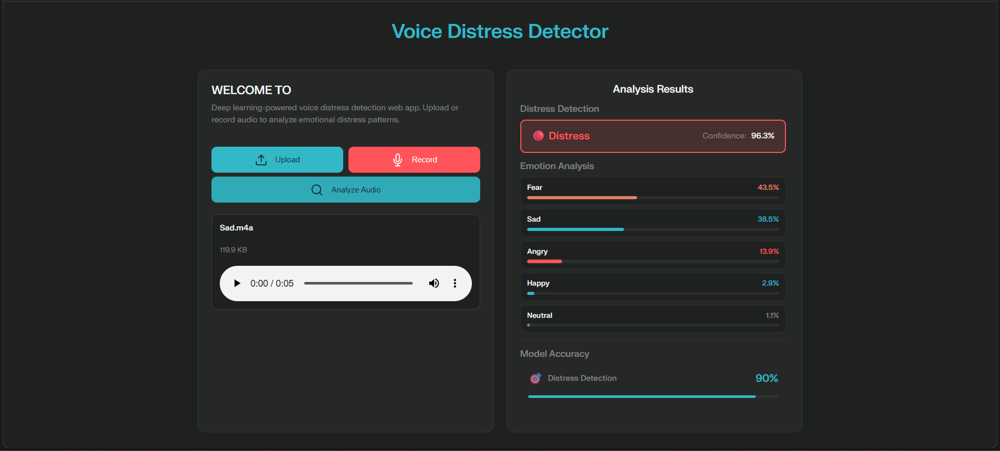

# DisTect

DisTect is a deep learning-based voice distress detection system that analyzes speech audio to predict both emotional distress . It  uses a hybrid CNN-BiLSTM-Attention model trained on a combined corpus of CREMA-D, RAVDESS, and TESS speech datasets.


## Features

- Multi-task prediction for distress detection and emotion classification.
- 275-dimensional feature array built from MFCC, delta, delta-delta, chroma, mel-spectrogram, spectral contrast, tonnetz, zero-crossing rate, and RMS energy.
- Hybrid CNN-BiLSTM-Attention architecture.
- Flask web application for browser-based prediction.


## Model Architecture

The system uses a **Hybrid CNN-BiLSTM** model for speech distress detection.

### Input
- MFCC features from raw audio 

### CNN Block
- Extracts frequency-domain features from MFCC spectrograms
- `Conv2D` → `MaxPooling2D` → `BatchNormalization`

### BiLSTM Block
- Captures time-dependent patterns in both directions
- Forward + Backward LSTM for richer temporal understanding

### Regularization
- `Dropout` and `L2 regularization` to reduce overfitting

### Output
- `Dense` + `Softmax` → probability per distress

## Project Structure

```text
DisTect/
├── app.py
├── predict.py
├── models/
│   ├── distress_detection_model_v2.keras
│   ├── feature_scaler_v2.joblib
│   └── label_encoder_v2.joblib
├── UI/
│   ├── css/
│   │   └── style.css
│   ├── js/
│   │   └── main.js
│   └── templates/
│       └── index.html
├── notebook/
│   └── model_v2.ipynb
└── README.md
```

## How It Works

1. The user uploads or records an audio file in the browser.
2. The Flask backend saves the file temporarily.
3. `predict.py` loads the audio and extracts a 275-dimensional feature array.
4. The feature array is scaled using the saved `StandardScaler`.
5. The trained model predicts distress and emotion labels.
6. The results are returned as JSON and displayed on the web page .

## Model Details

The prediction engine loads three saved artifacts:

- `distress_detection_model_v2.keras`
- `feature_scaler_v2.joblib`
- `label_encoder_v2.joblib`


## Requirements

- Python 3.8 or above
- TensorFlow
- Flask
- Flask-CORS
- librosa
- NumPy
- scikit-learn
- joblib
- soundfile


## Dataset Used

The model is trained on a combined emotional speech corpus built from:

- CREMA-D
- RAVDESS
- TESS

The original data is augmented using:

- Gaussian noise injection
- Pitch shifting
- Time stretching at two rates .

  ## Screenshots




## Results

The system achieves strong performance on the held-out test set, with over 90% accuracy for distress detection and good emotion classification performance. It is intended as an academic research and demonstration system .

## Limitations

- Works only with speech audio.
- Designed for five emotion classes only.
- Distress is mapped from angry, fear, and sad emotions.
- It is not a certified clinical or medical tool.
- Performance may vary on noisy or non-English speech.

## Future Work

- Add more datasets.
- Support more emotion classes.
- Improve robustness to background noise.
- Explore transformer-based models such as Wav2Vec 2.0 or HuBERT.
- Add explainability for model predictions.

## License

This project is intended for academic use. please contact the author if you plan to publish it publicly.

## Author

**Mohammed Naseef AK**  
